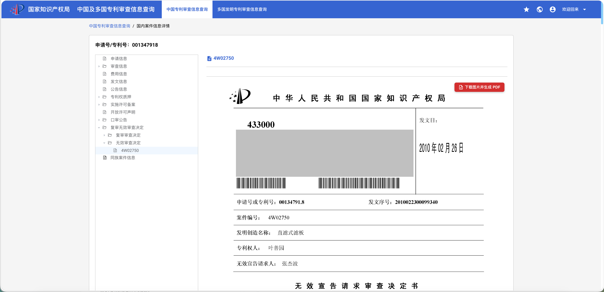
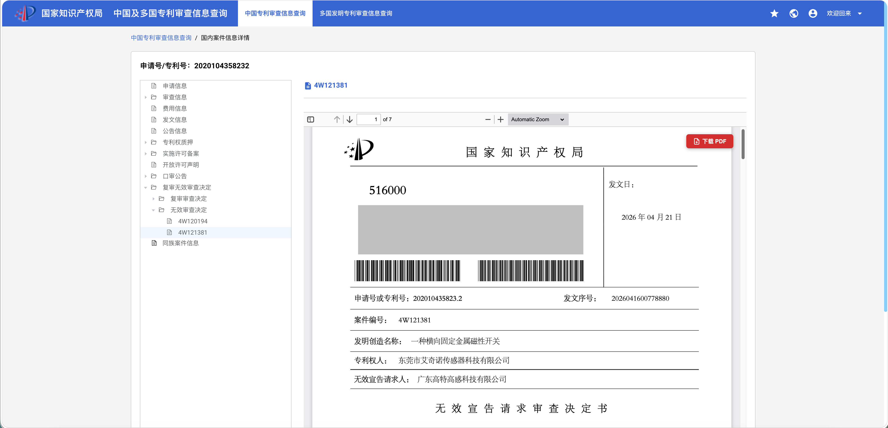
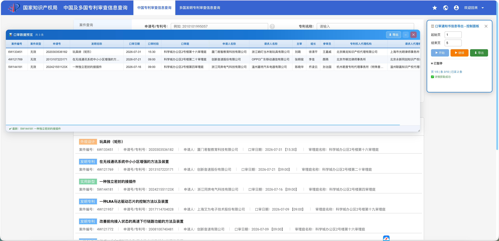
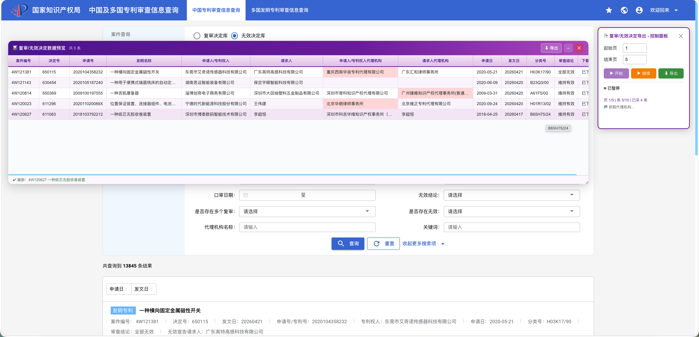
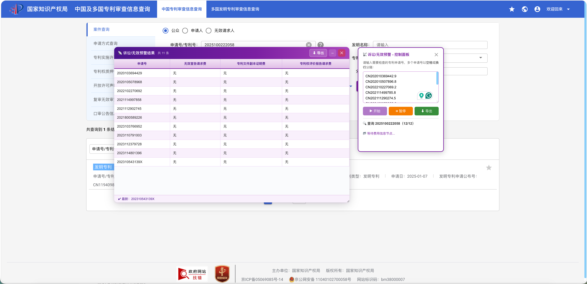
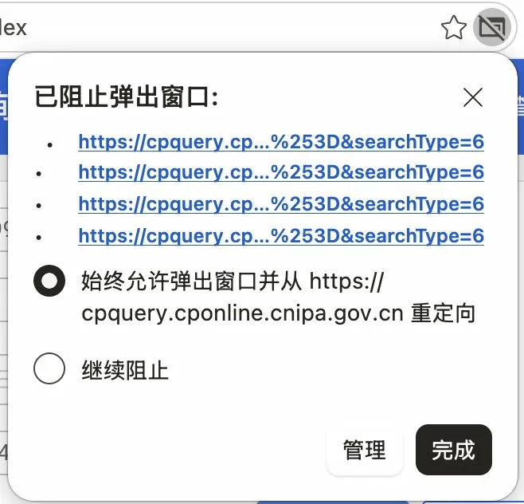
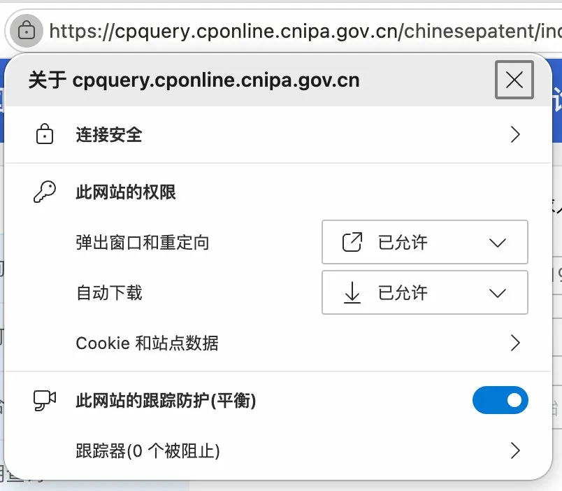

# 专利信息查询增强工具
> Chrome 扩展 · 适用于 [国家知识产权局专利检索及分析系统](https://cpquery.cponline.cnipa.gov.cn/)
> 
> **当前版本：v4.0**

---

## 功能概览

<table>
  <thead>
    <tr>
      <th>功能</th>
      <th>说明</th>
      <th>截图</th>
      <th>权限</th>
    </tr>
  </thead>
  <tbody>
    <tr>
      <td>📄 图片转 PDF</td>
      <td>在案件详情页将多张图片合并为单一 PDF</td>
      <td></td>
      <td>所有人</td>
    </tr>
    <tr>
      <td>📥 PDF 直接下载</td>
      <td>在 PDF 查看器页面添加下载按钮，文件名含申请号和标题</td>
      <td></td>
      <td>所有人</td>
    </tr>
    <tr>
      <td>📊 口审通知书信息导出</td>
      <td>在口审公告列表页自动翻页并导出 Excel</td>
      <td></td>
      <td><strong>PRO</strong></td>
    </tr>
    <tr>
      <td>📋 复审/无效决定导出</td>
      <td>在无效决定列表页自动下载 PDF 并导出 Excel</td>
      <td></td>
      <td><strong>PRO</strong></td>
    </tr>
    <tr>
      <td>📡 诉讼/无效预警</td>
      <td>通过监测无效宣告请求缴费、专利登记簿副本缴费及专利权评价报告缴费记录，自动识别目标专利潜在诉讼或无效风险</td>
      <td></td>
      <td><strong>PRO</strong></td>
    </tr>
  </tbody>
</table>

## 安装方法

1. 前往 [Releases](../../releases) 页面，下载最新版本的 `.zip` 压缩包
2. 解压到本地任意文件夹
3. 打开 Chrome，地址栏输入 `chrome://extensions/`
4. 右上角开启**开发者模式**
5. 点击**加载已解压的扩展程序**，选择解压后的文件夹
6. 扩展图标出现在工具栏，安装完成

---

## PRO 功能解锁

点击工具栏扩展图标，在弹出的设置面板底部找到 **★ PRO** 区域：

1. 在**邮箱**栏输入您的授权邮箱
2. 在 **UUID** 栏输入对应的授权码
3. 点击**解锁**，验证通过后 PRO 功能即刻生效

> 授权码有效期为 **6 周**，解锁状态有效期为 **6 个月**，到期后需重新输入新授权码解锁。

本项目PRO功能仅提供给内部测试用户使用，恕不供外部人员使用。

---

## 使用说明

**注意：首次使用时浏览器可能拦截弹出窗口，请按以下方式处理：**

**方式一：** 点击提示选择「始终允许弹出窗口并从 cpquery.cponline.cnipa.gov.cn 重定向」

**方式二：** 点击地址栏左侧图标，在「弹出窗口和重定向」中手动改为「已允许」，并将「自动下载」同样设为「已允许」

> 权限设置完成后请**刷新页面**，再使用导出功能。

---

## 注意事项

- 本扩展仅供个人学习使用，已进行混淆，请勿破解
- PRO功能恕不提供外部人员使用
- 本扩展仅在 `cpquery.cponline.cnipa.gov.cn` 域名下运行，不读取或上传任何用户数据
- 批量处理时扩展会在每条记录间自动添加随机间隔，请勿在该过程中手动操作页面
- 导出的数据仅供参考，请以官方系统显示信息为准

